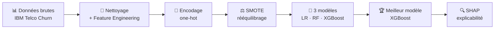

<div align="center">

# 📉 Customer Churn Prediction

### Prédire le désabonnement client avec du Machine Learning explicable

[](https://www.python.org/)
[](https://scikit-learn.org/)
[](https://xgboost.readthedocs.io/)
[](https://shap.readthedocs.io/)
[](https://plotly.com/)

</div>

---

## 🎯 Contexte métier

Dans le secteur des télécoms, **retenir un client coûte 5 à 7 fois moins cher que d'en acquérir un nouveau**. Ce projet construit un pipeline complet de Machine Learning permettant d'identifier, en amont, les clients les plus susceptibles de résilier — pour transformer un problème réactif (perdre un client) en un problème proactif (agir avant qu'il ne parte).

L'objectif n'est pas seulement de prédire *qui* va churner, mais aussi d'expliquer *pourquoi*, afin que les équipes marketing/rétention puissent agir sur des leviers concrets plutôt que sur une boîte noire.

---

## 🗂️ Structure du projet

```
churn-prediction/
│
├── data/
│   ├── WA_Fn-UseC_-Telco-Customer-Churn.csv   # Dataset brut (IBM Telco Churn)
│   ├── telco_clean.csv                        # Données nettoyées + features métier
│   └── telco_encoded.csv                      # Données encodées, prêtes pour le modèle
│
├── scripts/
│   ├── 01_EDA.ipynb                # Analyse exploratoire des données
│   ├── 02_preprocessing.ipynb      # Nettoyage, feature engineering, encodage
│   ├── 03_modeling.ipynb           # Entraînement & comparaison de 3 modèles
│   └── 04_explainability.ipynb     # Interprétation SHAP (globale & individuelle)
│
├── outputs/
│   ├── roc_curves.html             # Courbes ROC interactives (Plotly)
│   └── shap_importance.html        # Importance des features (Plotly)
│
└── src/
    ├── xgb_churn_model.pkl         # Modèle final entraîné (XGBoost)
    ├── scaler.pkl                  # StandardScaler ajusté sur le train
    └── feature_names.pkl           # Liste ordonnée des features attendues
```

---

## 🔄 Pipeline du projet



### 1. Nettoyage & Feature Engineering (`02_preprocessing`)
- Suppression de `customerID` (non prédictif)
- Conversion et imputation de `TotalCharges` (valeurs manquantes remplacées par la médiane)
- Encodage binaire de la cible `Churn`
- **Nouvelles features métier créées :**
  - `ChargesParMois` — charge mensuelle moyenne réelle (évite la colinéarité entre `TotalCharges` et `tenure`)
  - `NbServices` — nombre total de services souscrits par le client
  - `ClientFidele` — flag pour les clients avec plus de 24 mois d'ancienneté
  - `ContratCourt` — flag pour les contrats mensuels (facteur de risque connu)
- Encodage one-hot des variables catégorielles

### 2. Modélisation (`03_modeling`)
- Split train/test 80/20 stratifié sur la cible
- **SMOTE** pour rééquilibrer la classe minoritaire (churn) sur le train uniquement
- **StandardScaler** pour la normalisation
- Comparaison de **3 algorithmes** :

| Modèle | AUC (test) | AUC (cross-validation) |
|---|---|---|
| Logistic Regression | **0.839** | 0.931 ± 0.063 |
| Random Forest | 0.821 | 0.932 ± 0.044 |
| XGBoost | 0.807 | 0.932 ± 0.061 |

En cross-validation, les 3 modèles sont quasiment équivalents (~0.93 d'AUC, écarts-types qui se chevauchent). Sur le test set, la Logistic Regression a le meilleur AUC.

**Modèle retenu : XGBoost.** Le choix n'est pas justifié par l'AUC (les 3 modèles sont proches), mais par sa compatibilité native avec SHAP (`TreeExplainer`) pour l'explicabilité — étape centrale de ce projet — et sa capacité à capter des interactions non-linéaires entre features sans feature engineering manuel supplémentaire. Une amélioration possible serait de tuner ses hyperparamètres (`max_depth`, `learning_rate`, `n_estimators`) pour aller chercher un gain d'AUC plus net sur le test set.

- Évaluation : AUC-ROC, classification report, matrice de confusion, courbes ROC comparatives (voir `outputs/roc_curves.html` pour les scores exacts)

### 3. Explicabilité (`04_explainability`)
- **SHAP TreeExplainer** appliqué au modèle XGBoost
- Importance globale des features (top 10) → `outputs/shap_importance.html`
- Beeswarm plot pour visualiser la distribution des impacts par feature
- Explication individuelle (waterfall plot) pour comprendre la décision du modèle client par client

---

## 🧠 Stack technique

`Python` · `Pandas` · `NumPy` · `Scikit-learn` · `XGBoost` · `imbalanced-learn (SMOTE)` · `SHAP` · `Plotly` · `Jupyter`

---

## 🚀 Lancer le projet

```bash
# Cloner le repo
git clone https://github.com/imene-datascience/churn-prediction.git
cd churn-prediction

# Installer les dépendances
pip install pandas numpy scikit-learn xgboost imbalanced-learn shap plotly joblib jupyter

# Exécuter les notebooks dans l'ordre
jupyter notebook scripts/01_EDA.ipynb
```

Pour réutiliser le modèle déjà entraîné directement :

```python
import joblib

model = joblib.load('src/xgb_churn_model.pkl')
scaler = joblib.load('src/scaler.pkl')
features = joblib.load('src/feature_names.pkl')

# X_new : DataFrame avec les mêmes colonnes que `features`
X_scaled = scaler.transform(X_new[features])
proba_churn = model.predict_proba(X_scaled)[:, 1]
```

---

## 📌 Prochaines étapes

- [ ] Scoring individuel du risque de churn par client (probabilité + segmentation en tiers de risque)
- [ ] Export d'une liste priorisée des clients à risque pour les équipes rétention
- [ ] Application interactive (Streamlit) pour explorer les prédictions en temps réel

---

## 👤 Auteure

**Imene Bouzidi** — Étudiante M1/M2 Data Science & AI, DSTI School of Engineering
📍 Paris | [GitHub](https://github.com/imene-datascience)

</div>
